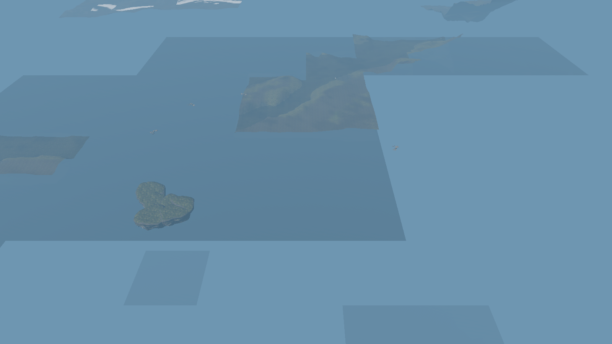
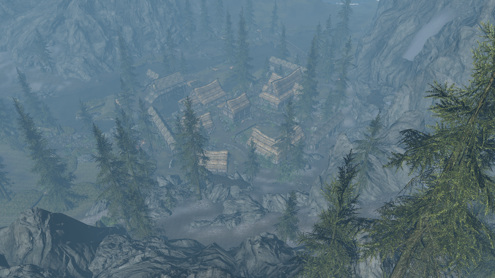

# Fiji terrain retry startup validation

Twenty fresh Riverwood starts with the retry fix passed lifecycle checks and individual image review. Neither reviewer saw an obvious terrain hole in the saved views. Both constrained-budget baseline controls, taken before and after the fixed cohort, showed broad missing landscape and village geometry despite passing CPU readiness checks.

| Binary and upload budget | Starts | Missing geometry in saved images |
| --- | ---: | ---: |
| Baseline, 16 MiB | 2 | 0 |
| Baseline, 1 MiB | 2 | 2 |
| Retry fix, 16 MiB | 10 | 0 |
| Retry fix, 1 MiB | 10 | 0 |

The [per-run results](terrain-retry-fiji-20261009/results.json) retain timestamps, binary/input hashes, screenshot hashes, lifecycle validation, retry accounting and visual decisions. Every capture has a distinct process group and PNG hash. The primary agent and an independent subagent inspected all 24 original 1600×900 images.

`functional_validation.visual_inspection` retains the original automated `pending` placeholder; `visual_review` records the final image-review decision for each run.

Fiji ran NixOS 26.11 with an RX 6700 XT using RADV/Vulkan. The matched quick-profile binaries use baseline `c39449b5a8b6a62c7c3c43bb60164e8ba6911839` and fix `2e47a1bbf70a01e6582226353837794613abc1a3`; later PR changes affect tests, capture tooling and documentation. Binary and mesh-retry source hashes are recorded in the results.

The scenario matches the earlier profiling recipe: worldspace `0x3c`, grid `(5,-12)`, radius `2`, camera offset `(0,6000,8000)`, 1,200 warmup frames and 30 measured seconds. Each start used an isolated headless gamescope session. Operating-system caches were preserved. These runs support a functional result and make no performance claim.

All 24 runs completed with 25 resident cells, 2,029 ready model instances, 100 validated terrain patches, empty queues and zero reported engine validation failures. Fixed runs retried 22–232 candidates at 16 MiB and 4,094–4,753 at 1 MiB. Every retry record balances `tracked = resumed + canceled + pending`; final pending is zero. Cancellations range from 0–53 and 0–178 respectively. The last retry drain precedes warmup completion in every fixed run. Baseline indirect batch sets fell to 56 and 98 in the failed images; all fixed runs recorded 193. Batch-set counts corroborate the render workload but do not establish pixel coverage.

The original capture validator flagged gamescope's exact `NO CURSOR IMPL XDG` message. The reviewed validator records that cursor warning and still rejects other errors. Original and reviewed results are preserved separately. Two earlier launches that failed to initialize the display are excluded from these 24 runs.

The full archive remains on Fiji at `/var/tmp/mudcrab-terrain-pr-20261009-2e47a1b/terrain-startup-captures.tar.gz`, SHA-256 `10d38ef482a142b8e04a5d7ed81e0d65306779b0b41ec4a7a1dc2ad3a3160b88`. It contains raw logs, reports, frame CSVs, profiles, images, build receipt and both validator versions. The engine and five primary asset inputs were hashed before and after each launch; individual mesh and texture payloads were not hashed.

The screenshots are post-warmup captures, not end-of-run images. The logs prove the initial camera pose. Image dimensions are checked against profiling metadata, whose requested-resolution fallback does not independently measure the surface. Fog and vegetation conceal some ground. This finite campaign establishes the saved-view results above, not continuous or universal coverage. See [the runner guide](../contributing/repeated-terrain-startup.md) to repeat the campaign.
