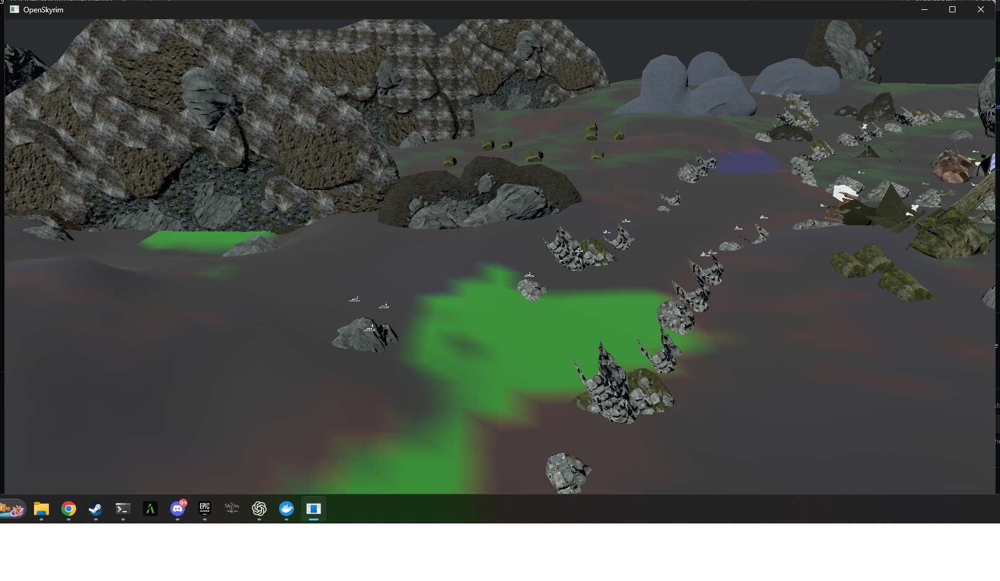

# Plano de conclusão da Phase 2

## Objetivo

Encerrar a Phase 2 com um veredito reproduzível `accepted` no hardware-alvo, usando os assets
legalmente extraídos do Skyrim, sem falhas de assets ou streaming e com evidência visual assinada
para os cenários rural, denso, água e stress.

Este plano complementa `02-core-engine.md`, `02-integration-and-acceptance.md`,
`02-profiling.md` e `02-acceptance.md`. O status da Phase 2 só pode mudar para concluído quando
todos os critérios de saída deste documento forem satisfeitos.

## Fronteira da fase

### Incluído na Phase 2

- geometria estática usada por `STAT`, `MSTT` e `FURN`, inclusive `BSTriShape`,
  `BSDynamicTriShape`, `BSLODTriShape` e o legado `NiTriShape`/`NiTriShapeData` quando alcançável;
- materiais e texturas necessários para renderizar esse conjunto;
- bounds corretos para todos os oito cantos transformados;
- streaming exterior/interior, origem flutuante e ciclo de vida de células;
- batching/indirect drawing, frustum culling e HZB occlusion culling;
- terreno de seis camadas e água com reflexão não recursiva;
- profiling, regressão, robustez e aceitação no hardware-alvo.

### Não bloqueia a Phase 2

- reprodução e blending de animações, state machine e combate;
- física Rapier, conversão de colisão Havok e ragdolls;
- simulação de partículas e controladores de efeitos;
- runtime completo de meshes de personagens com skinning.

Esses itens pertencem principalmente à Phase 4. O exportador de skinning prometido pelo pipeline
da Phase 1 deve ser acompanhado como dívida separada; ele só volta a bloquear este plano se um mesh
alcançável por `STAT`, `MSTT` ou `FURN` depender dele para sua representação visual da Phase 2.

## Estado inicial confirmado

- o corpus auditado contém 22.047 NIFs estruturalmente legíveis e uma ocorrência com geometria
  ainda não exportável;
- a auditoria completa ainda não tentou converter o corpus (`conversion_attempts: 0`), portanto
  leitura estrutural não equivale a compatibilidade visual;
- o conjunto rural selecionado converte e o teste curto passa com 167,09 FPS médios,
  P95 de 12,98 ms, crescimento de 0,11 GiB e zero falhas de streaming;
- a evidência existente cobre somente o cenário rural curto;
- a última campanha geral disponível é `accepted-with-warnings`: sem assets reais completos,
  baseline, quality/robustness gates e revisão visual;
- a câmera principal possui `DepthPrepass`, mas a conformidade do HZB occlusion culling descrito
  no roadmap precisa ser restaurada e demonstrada após a correção visual dos NIFs.

## Evidência visual atual



A captura comprova o carregamento de terreno, pedras, vegetação e estruturas a partir dos assets
convertidos. Ela é uma evidência WIP, não o aceite visual final: a mistura do terreno e alguns
materiais ainda precisam cumprir os Marcos 3 e 4 antes do veredito `accepted`.

## Plano de desenvolvimento

### Marco 0 — Fixar escopo e baseline de falhas

**Implementação**

1. Criar um comando de `asset closure` que percorra o banco e produza a lista única de meshes e
   texturas alcançáveis por `STAT`, `MSTT` e `FURN` no load order convertido.
2. Estender o relatório de integração com contagens por tipo de record, tipo de bloco NIF e motivo
   de exclusão; não agregar conteúdo não renderizável com falhas reais.
3. Guardar como fixtures mínimas, sem conteúdo proprietário no Git, as descrições estruturais e
   hashes dos casos que falham.
4. Registrar a versão exata do jogo/load order, resolução, driver, commit e coordenadas dos quatro
   cenários reais.

**Saída**

- relatório inicial determinístico;
- lista de bloqueadores limitada ao conjunto realmente consumido pela Phase 2;
- nenhum fallback genérico pode mascarar geometria alcançável.

### Marco 1 — Completar a geometria NIF estática alcançável

**Implementação**

1. Implementar leitura e exportação de `NiTriShape` e `NiTriShapeData`: posições, normais,
   tangentes quando disponíveis, UVs, cores, índices e transforms.
2. Suportar `NiTriStripsData` apenas se aparecer no `asset closure`; converter strips em
   triângulos com winding validado.
3. Unificar as famílias `BSTriShape`, `BSDynamicTriShape`, `BSLODTriShape` e `NiTriShape` em uma
   representação intermediária validada antes da geração do GLB.
4. Validar cardinalidade, índices fora dos limites, valores não finitos, AABB e winding. Uma
   inconsistência deve gerar erro com arquivo/bloco, nunca panic ou GLB parcial.
5. Preservar hierarquia e transforms de `NiNode`/`BSFadeNode`; calcular bounds a partir do GLB
   final e da hierarquia, não do buffer NIF isolado.
6. Adicionar testes unitários sintéticos e testes de regressão locais para o pressure plate legado
   que atualmente concentra a geometria sem suporte.

**Saída**

- zero `unsupported_geometry_files` no `asset closure`;
- 100% dos GLBs alcançáveis passam no validador estrutural e na auditoria de bounds;
- o conversor não produz panic em nenhum dos 22.047 arquivos auditados.

### Marco 2 — Fechar materiais e dependências de textura

**Implementação**

1. Consolidar o mapeamento por slot de `BSShaderTextureSet` para diffuse, normal, glow e
   specular/environment, com regras explícitas por shader.
2. Implementar as flags visuais necessárias ao conjunto estático: alpha test/blend, double-sided,
   emissive e parâmetros de gloss/roughness.
3. Fazer a integração verificar cada URI KTX2 referenciada no GLB e distinguir textura opcional de
   dependência obrigatória.
4. Criar testes para caminhos com caixa diferente, barras Bethesda, espaços, ausência de sufixo e
   colisão de nomes normalizados.

**Saída**

- zero meshes inválidos e zero texturas difusas obrigatórias ausentes no relatório de integração;
- nenhuma textura ausente no log dos quatro cenários de aceitação;
- materiais representativos aprovados por comparação visual.

### Marco 3 — Restaurar e provar o caminho de renderização da Phase 2

**Implementação**

1. Reativar `OcclusionCulling` na câmera principal junto com `DepthPrepass` e corrigir qualquer
   desaparecimento provocado por bounds, transforms ou asset readiness.
2. Adicionar um teste de cena com objetos atrás e à frente de um oclusor, câmera em rotação e
   escalas não uniformes; a geometria visível não pode sumir prematuramente.
3. Confirmar GPU preprocessing, batching e indirect drawing em build `release`; registrar as
   capacidades realmente expostas pelo backend e marcar somente contadores indisponíveis como tal.
4. Medir 250 mil instâncias sintéticas e uma área densa real. Se o caminho Bevy não cumprir os
   thresholds, otimizar batches/buffers antes de considerar um renderer paralelo.

**Saída**

- HZB/frustum culling habilitados no executável de release;
- teste de visibilidade passa em rotação, escala e streaming;
- cenário sintético e cenário denso cumprem os thresholds padrão.

### Marco 4 — Corrigir fidelidade de terreno e água

**Implementação**

1. Criar uma inspeção por célula para alturas, normais, cores, seis índices de textura e pesos
   normalizados; rejeitar NaN, camadas inválidas e seams acima da tolerância.
2. Comparar os pesos enviados ao shader com os seis canais do cache e corrigir orientação de UV,
   escala, seleção de layer e mistura da camada base.
3. Validar a costura entre as quatro bordas de células vizinhas e o winding do terreno.
4. Validar água em câmera acima/abaixo do plano, movimento rápido e bordas de célula; impedir que a
   câmera refletida renderize a própria camada de água.
5. Acrescentar screenshots determinísticos de fixtures sintéticas de terreno e água aos testes de
   regressão visual locais.

**Saída**

- ausência de rachaduras e bordas invertidas;
- seis camadas coerentes com os dados de origem;
- reflexão estável, sem recursão e com flow normal carregado quando disponível.

### Marco 5 — Endurecer streaming e ciclo de vida

**Implementação**

1. Testar travessia rápida, teleporte, mudança exterior/interior e rebasing repetido.
2. Tornar verificáveis as invariantes: uma raiz por célula, uma requisição ativa por chave,
   resposta stale descartada, unload completo e zero entidades órfãs.
3. Cobrir erros de SQLite, cache truncado, manifest antigo, asset ausente e encerramento do worker.
4. Manter o orçamento por frame para commits e geração de terreno; registrar máximos e timeline no
   bundle de profiling.

**Saída**

- zero falhas de streaming;
- zero células duplicadas ou entidades órfãs após stress;
- memória estabiliza dentro do limite de 0,5 GiB de crescimento.

### Marco 6 — Consolidar gates automatizados

**Implementação**

1. Executar `cargo fmt --all -- --check`, testes de todos os targets, Clippy com warnings negados e
   build `release` do workspace.
2. Executar todos os casos negativos de schema, manifest, banco, cache, bundle e assets ausentes.
3. Adicionar o `asset closure` e a auditoria GLB ao preflight da aceitação.
4. Fazer qualquer cenário omitido, screenshot ausente, fallback de geometria alcançável ou log de
   erro relevante resultar em `rejected`.
5. Executar os mesmos comandos no workflow Windows GPU e reter os bundles sem copiar assets.

**Saída**

- quality e robustness gates passam sem opções `Skip*`;
- uma falha injetada produz `rejected` e código de saída não zero;
- o bundle contém todos os artefatos descritos em `02-acceptance.md`.

### Marco 7 — Executar profiling e aceitação finais

**Implementação**

1. Rodar três repetições em `release` para synthetic, rural, dense, water, stress e stability.
2. Gerar um baseline aprovado no mesmo hardware, resolução, driver e configuração.
3. Repetir a campanha contra o baseline; regressão acima de 10% reprova, acima de 5% gera warning
   que deve ser explicado.
4. Revisar os screenshots após warm-up e preencher `visual-review.json` com revisor, data, status e
   observações para rural, dense, water e stress.
5. Rodar a campanha final a partir de um commit identificável e worktree limpa.

**Saída**

- média de FPS >= 60;
- P95 <= 16,67 ms;
- crescimento de memória <= 0,5 GiB;
- zero falhas de streaming;
- baseline disponível e nenhuma regressão fatal;
- revisão visual completa e assinada;
- veredito final exatamente `accepted`, sem warnings.

### Marco 8 — Encerrar documentação e status

**Implementação**

1. Vincular o bundle final e seus hashes no resumo de release, sem versionar assets proprietários.
2. Atualizar divergências entre documentação e implementação, especialmente o estado do HZB e os
   contadores GPU disponíveis.
3. Mover animação, partículas, skinning de personagens e colisão para o backlog explícito da
   Phase 4/Phase 1, sem apresentá-los como funcionalidades da Phase 2.
4. Somente após o veredito `accepted`, marcar a Phase 2 como concluída no roadmap e README.

## Ordem de execução

```text
M0 asset closure
 └─> M1 geometria ─> M2 materiais ─┐
                                   ├─> M6 gates ─> M7 campanha ─> M8 encerramento
M3 renderer ───────────────────────┤
M4 terreno/água ───────────────────┤
M5 streaming ──────────────────────┘
```

Depois do Marco 0, os Marcos 1–2, 3, 4 e 5 podem avançar independentemente. O Marco 6 só começa
quando os quatro fluxos estiverem verdes; o Marco 7 deve usar exclusivamente o build resultante.

## Critério único de conclusão

A Phase 2 está completamente implementada somente quando existir um bundle recente, reproduzível,
executado com assets reais no hardware-alvo, cujo `acceptance-report.json` tenha veredito
`accepted`, acompanhado de baseline e revisão visual assinada. Um teste rural isolado, um smoke
synthetic ou um resultado `accepted-with-warnings` não satisfaz esse critério.
