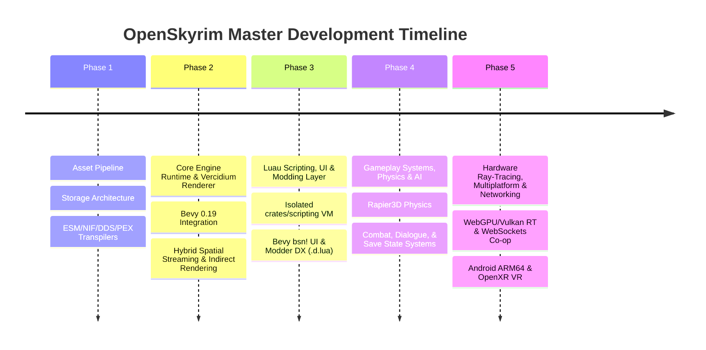

# OpenSkyrim Roadmap Index

Welcome to the technical roadmap for **OpenSkyrim**, an open-source engine reimplementation for *The Elder Scrolls V: Skyrim (Special Edition)* built in **Rust** using **Bevy Engine**, **Luau**, **SQLite 3**, and **WebGPU**.

---

## 🗺️ Master Strategic Phases

### 📂 Phase Specifications

1. **[`01-asset-pipeline.md`](01-asset-pipeline.md)**  
   *Ingesting legacy Skyrim SE formats (`.esm`, `.nif`, `.dds`, `.pex`) into modern GPU-native formats (`SQLite 3`, `glTF 2.0`, `KTX2`, `Luau`).*

2. **[`02-core-engine.md`](02-core-engine.md)**  
   *Bevy 0.19 ECS setup, camera hybrid spatial cell streaming (normalized exterior R-Tree + O(1) interior cell index), zero-copy `rkyv` heightmaps, and Vercidium GPU instanced indirect draw calls.*

3. **[`03-luau-and-ui.md`](03-luau-and-ui.md)**  
   *Isolated Luau JIT runtime crate (`crates/scripting`), `.d.lua` type definitions generator, async HTTP APIs, declarative Flash-to-Bevy `bsn!` UI, and the launcher setup wizard.*

4. **[`04-gameplay-and-physics.md`](04-gameplay-and-physics.md)**  
   *Rapier 3D collision physics, glTF animation blending, combat state machine, and sub-second save state persistence.*

5. **[`05-multiplatform-and-networking.md`](05-multiplatform-and-networking.md)**  
   *Hardware ray-tracing, DLSS 3/FSR 3 frame generation, WebSocket native co-op multiplayer, Android ARM64 port, and OpenXR VR.*
