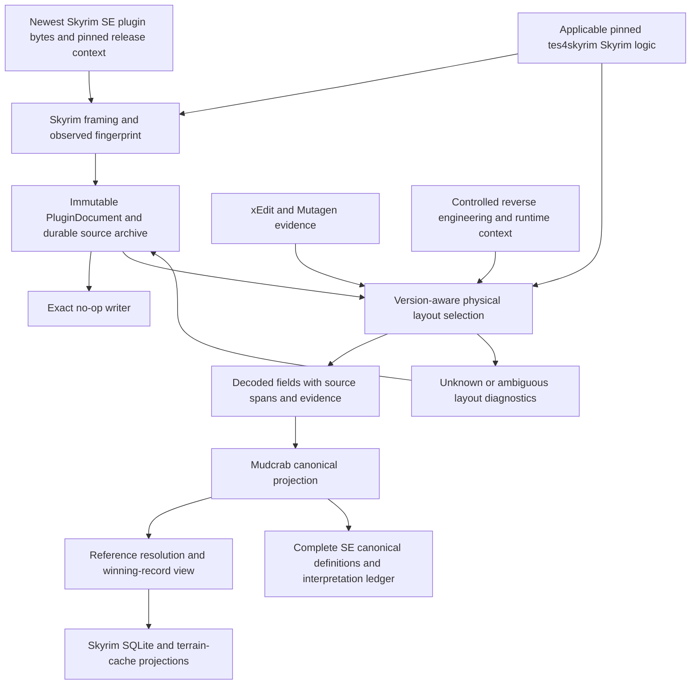

# Mudcrab Dynamic Schema Initiative — implementation plan

Status: P0 source inventory and corpus/validator tooling started; phase gate pending. Revised on 2026-10-04: newest-version Skyrim SE first; earlier SE and VR next, then LE, then other games. No parser implementation or phase acceptance claimed. The [research directory](../research/dynamic-schema/README.md) records current evidence and gaps.

Baseline: `5579f007ad296c2e7134f1dbf2b8eb8cec5369fd`, inspected 2026-10-04. This plan extends offline plugin ingestion. The root [SPEC.md](../../SPEC.md) owns current movement and dynamic-ingestion task states; existing movement goals and task states remain intact. The scoped spec handoff is now adopted in root SPEC; its planning snapshot below remains the phase contract reference.

## Goal and scope

The minimum target is **100% of the newest Skyrim Special Edition record catalog correctly interpreted and available to Mudcrab**, with complete binary preservation and compatibility with its current converter/runtime consumers. Complete structural extraction is an early foundation; complete Skyrim SE interpretation is the release gate.

Delivery order is fixed:

1. Newest Skyrim SE, including AE-era data/serialization updates: complete record interpretation and current Mudcrab compatibility.
2. Earlier Skyrim SE versions, working backwards, and Skyrim VR.
3. Skyrim LE.
4. Eventually Morrowind, Oblivion, Fallout 3 and Fallout: New Vegas, the source games named by [tes4skyrim](https://github.com/bryantmh/tes4skyrim/blob/c43d5b8c555cff2fe9f6945794c6225acce5df40/README.md#L34-L40), with their DLC and applicable total conversions.

P0–P6 serve newest SE exclusively. P7–P9 are deferred expansion stages and cannot open before predecessor acceptance. No TES3/Oblivion reader, non-Skyrim identity system, OpenMW adapter or all-game public API is required for the minimum target. Existing research about those games is retained for future use.

The initial runtime target is **Steam Skyrim SE/AE 1.7.104.0, Steam build 24914197**, matching the reverse-engineering workbench. P0 completes its source-data pin, including installed official content and input hashes. Executable version, serialized record form version and content revision remain distinct. Older serialized records accepted by the newest SE game belong to its input contract; supporting earlier SE game releases is the later P7 task.

Canonical definitions belong to Mudcrab. xEdit supplies the primary serialization evidence; Mutagen supplies independent checks; controlled reverse engineering resolves unexplained behavior. CommonLibSSE-NG supplies runtime context and the accessor analogy. None of those projects defines Mudcrab's consumer API.

### Reverse-engineering stack and existing evidence

Read-only inspection of `mudcrab-reverse-engineering` on 2026-10-04 established the following pins. The references marked local-only point into a separate checkout and have no repository or public equivalent here; DS1 records durable source/artifact identities before acceptance.

| Input | Recorded pin and role | Evidence |
| --- | --- | --- |
| Acceptance runtime | Steam SE/AE `1.7.104.0`; build `24914197`; executable SHA-256 `846efccf0c1374d71f892907f46549560f2fcb0a75cb87a3eed438baa0f1402f` | local-only: `/home/dev/.t3/projects/mudcrab-reverse-engineering/tools.lock.toml:12`, `/home/dev/.t3/projects/mudcrab-reverse-engineering/ledger/findings/F0001.json:4` |
| Static importer-native build | `1.6.1170.0`; SHA-256 `c434208894f07f604b852f29b8edc3a58c4de63de783373733e72b2b73f33be9`; Fiji backup-tar provenance, not Steam-manifest verified | local-only: `/home/dev/.t3/projects/mudcrab-reverse-engineering/tools.lock.toml:4`, `/home/dev/.t3/projects/mudcrab-reverse-engineering/SPEC.md:19` |
| Static tools | Ghidra `12.1.2`, ghidra-mcp `6.0.0`, BethesdaGhidraScripts `702c93272fd65a610b39e21b5cdd754131390237`; bundled CommonLib `9d0e483f869cc7e82d5fe7e36939a6a3f9380163` and AddressLibraryDatabase `0379cb6fdaa0d68e69ef9ad1a2d39caa6611ac91` | local-only: `/home/dev/.t3/projects/mudcrab-reverse-engineering/tools.lock.toml:20` |
| Existing record oracle | `Mutagen.Bethesda.Skyrim 0.54.4`, `net9.0`, .NET SDK `9.0.318`; `oracles/records` uses `SkyrimRelease.SkyrimSE` | local-only: `/home/dev/.t3/projects/mudcrab-reverse-engineering/oracles/records/Program.cs:1`, `/home/dev/.t3/projects/mudcrab-reverse-engineering/oracles/records/records.csproj:10`, `/home/dev/.t3/projects/mudcrab-reverse-engineering/tools.lock.toml:75` |
| Official-data corpus | Full Data/Creation manifest is not yet pinned. Existing field/count evidence covers `Skyrim.esm`; Update, DLC, official content, locale and companion tables need a complete manifest | local-only: `/home/dev/.t3/projects/mudcrab-reverse-engineering/SPEC.md:149`, `/home/dev/.t3/projects/mudcrab-reverse-engineering/ledger/findings/F0005.json:12` |

Static analysis runs on `t3-dev` with `$MCRAB_STORE=/home/dev/mcrab-store`; runtime observation is planned for `skyrim-vm`. Names/types transfer from 1.6.1170 to 1.7.104 only through Address Library IDs or reviewed hash matches. Older-build semantics require explicit applicability evidence before acceptance on 1.7.104. DevBench support for 1.7.104 remains unverified. Do not interfere with the active decompilation or change the RE tool locks.

Native findings retain build/hash, input identity and ledger provenance, and distinguish static inference from observed runtime behavior. Mudcrab receives independently authored implementations of evidenced behavior; proprietary binaries and decompiled source stay outside its repository.

Reuse and extend the existing Mutagen oracle rather than create a second wrapper. It currently enumerates placed records and emits identity, flags, EditorID and enable-parent data. F0005 records matching counts across seven placed-record categories on the same `Skyrim.esm`; this is existing pilot evidence, not a full-catalog or runtime-behavior result. F0006/F0007 are useful gap candidates, but their handwritten walkers are not independent validators and their Mudcrab baseline needs refreshing.

The initial corpus manifest must explicitly include `Skyrim.esm`, `Update.esm`, `Dawnguard.esm`, `HearthFires.esm`, `Dragonborn.esm` and the installed official Creation plugins/bundles selected for this target. Inventory actual files and dependencies; do not infer a Creation list from the executable version. Missing official variants remain acceptance gaps, covered by explicitly sourced synthetic cases only where the contract permits. The executable pin alone does not establish a content revision.

P0 has begun with a [provisional source-declaration inventory](../research/dynamic-schema/README.md): 127 shared candidate signatures and six xEdit-only candidates. Its broad source-release scope and declaration-only method are explicit. Reconcile applicability before establishing the accepted newest-SE catalog; these counts are not an interpretation percentage. The [local issue proposals](dynamic-schema-issue-proposals.md) split the first work wave and record current overlaps.

### Delivery scope and deferred profiles

The newest-SE milestone includes base-game masters, updates, DLC, current official-content record variants and representative valid mods using that release's serialization capabilities. It covers the entire record catalog, including types absent from a Riverwood conversion. Imported definitions must be available to future Mudcrab consumers even when their gameplay systems are not implemented yet.

| Stage | Target | Entry condition | Work owned here |
| --- | --- | --- | --- |
| P0–P6: minimum target | Newest Skyrim SE | Start here | Complete latest-SE catalog, 24-byte grouped framing, newest capabilities, references, canonical interpretation and current engine integration |
| P7: deferred | Earlier SE and VR | P6 accepted | Backwards SE layout/capability map, VR differences, independent corpora and newest-SE non-regression |
| P8: deferred | Skyrim LE | P7 accepted | LE layouts/encodings and reference rules; preserve accepted SE/VR results |
| P9: eventual | Morrowind, Oblivion, Fallout 3, New Vegas | P8 accepted | New native envelopes/identities and per-game validation; DLC and Nehrim/Arktwend/Morroblivion cases when these games are opened |

### Meaning of 100% newest-SE interpretation

P0 establishes an explicit catalog/variant/field ledger from xEdit, Mutagen, official masters/content and native evidence. P4 completes it; P6 accepts it. A success claim requires all of the following:

- Every newest-SE record signature and valid physical variant has an accepted layout and a Mudcrab canonical representation, including records not used by today's renderer.
- Every field, array, union, flag, reference and specialized structure in that catalog has correct decoding and an evidenced meaning. Omitted fields, raw-only records, unknown tails and disputed semantics remain completion blockers. Verified reserved/padding ranges are identified explicitly; calling an unexplained range reserved does not close it.
- All valid occurrences in the acceptance corpus match independent expected values, reference ownership, override/deletion behavior and localization. Real absent optional fields are accepted; failed decoding cannot masquerade as absence.
- Unknown bytes and unfamiliar valid mod extensions remain preserved at every intermediate stage. A newly discovered latest-SE variant updates the ledger and blocks the 100% claim until resolved; raw retention never counts as correct interpretation.

The denominator covers record types, physical variants, field/range interpretation and corpus occurrences separately. A test corpus alone does not define the catalog. Agreement on copied algorithms is not independent proof. Unresolved behavior requires controlled reverse engineering rather than a weaker milestone.

Compatibility here means correct record definitions/references exposed to Mudcrab and verified integration with its supported runtime behavior. Implementing every Skyrim gameplay system remains separately owned; complete data interpretation must not be limited to currently implemented systems.

## Reuse tes4skyrim without expanding the minimum target

Source pin: `c43d5b8c555cff2fe9f6945794c6225acce5df40`. Reuse only logic that directly helps newest-SE correctness during P0–P6, at Mudcrab's existing scanner/codec owners. Its Skyrim SE output is a conversion destination, not evidence of complete native Skyrim interpretation. Keep attribution and independent validation for each reused algorithm/test vector. Future-game ports remain deferred to P9.

| Upstream logic | Timing and reuse decision | Required adaptation/proof |
| --- | --- | --- |
| `tes5_import/base/tes5_reader.py`, applicable comparison tests/tools | P0–P6 candidate: inspect narrowly for useful Skyrim group/context and decoder logic | Existing bounded Mudcrab parsing stays responsible; fix upstream loss/silent fallbacks; source-derived tests do not independently corroborate the port. |
| `core/plugin_masters.py` | P0–P6 candidate only where it improves existing Skyrim owner/master rules | Retained snapshot input; explicit missing/cyclic/ambiguous masters; existing full/light slots and GMST identity rules retain parity. |
| `tes4_export/tes3_reader.py`, `tes4_reader.py` | P9: native TES3 and 20-byte TES4 envelope ports | Preserve native headers; replace silent truncation/header guesses and swallowed zlib errors with explicit bounded outcomes. |
| `tes4_export/morrowind_cell.py` | P9: positional CELL/reference-run codec | Verify moved/deleted references and native numbering; preserve 8192-unit cells and source runs. |
| `tes4_export/record_types/`, `export_falloutnv.py`, `asset_convert/sources/source_registry.py` | P9: evidenced native decoders and collection provenance | Per-title independent checks and native identities; no premature all-game tables/API in the SE milestone. |
| Target record replacement, synthesized IDs, cell splitting, runtime/asset bundles | Separate conversion contracts | Native ingestion preserves original records and geometry. |

The upstream text export is useful for comparisons, but is not the lossless intermediate. Unknown TES4 record types are exported as signatures/sizes without full payloads; several readers terminate malformed input silently, and conversions intentionally synthesize, drop or remap data. Retain the stronger structural contract already planned here.

The pinned README declares own code MIT, excludes `external/` and identifies GPL-derived code elsewhere. No full root MIT notice is present. For any module actually reused, verify its grant/notice/attribution before distributing copied source. An unused future-game module or license question is not a prerequisite for independently authored SE work. Per-file provenance governs reuse; third-party definitions/assets/runtimes do not inherit MIT through this repository.

## Current behavior and reusable boundaries

Paths below refer to the baseline commit. Line numbers are evidence anchors, not future implementation locations.

| Current boundary | Observed behavior | Required change |
| --- | --- | --- |
| [`esm/binary.rs`](../../crates/converter/src/esm/binary.rs), lines 137–168, 283–331 | Parses 24-byte record headers, discards some metadata and eight GRUP header bytes, omits TES4 from results. | Retain every header, TES4, group node, hierarchy, ordinal and span. |
| [`esm/binary.rs`](../../crates/converter/src/esm/binary.rs), lines 180–295 | Iterative group traversal accepts unknown record signatures and avoids recursive stack overflow. | Extend this traversal; preserve nesting instead of flattening it. |
| [`esm/extractors.rs`](../../crates/converter/src/esm/extractors.rs), lines 12–50 | Preserves ordered unknown/repeated subrecord payloads; removes XXXX framing and original short length. | Retain framing alongside logical payload views. |
| [`esm/binary.rs`](../../crates/converter/src/esm/binary.rs), lines 70–126, 249–279 | Validates bounded, complete zlib streams; discards original compressed bytes. | Keep validation and original streams; report resource-policy rejection separately. |
| [`esm/mod.rs`](../../crates/converter/src/esm/mod.rs), lines 75–125, 367–422 | Rewrites source IDs/payloads, retains winning records, removes deleted records. | Derive resolved views from immutable occurrences; preserve overrides and tombstones. |
| [`esm/load_order.rs`](../../crates/converter/src/esm/load_order.rs), lines 82–97, 143–166 | Distinguishes owning plugin/local ID from the winning override. | Reuse ownership and slot rules; retain source occurrence provenance too. |
| [`esm/exporter.rs`](../../crates/converter/src/esm/exporter.rs), lines 289–489 | Stores rkyv tag/payload blobs for winners and decodes fields directly into SQL. | Keep SQL consumer contracts; move physical decoding and reference classification into layouts. |
| [`esm/records/mod.rs`](../../crates/converter/src/esm/records/mod.rs), lines 1–27 | A few typed adapters use `parse -> Option<Self>`. Most interpretation lives elsewhere. | Replace ambiguous absence with explicit projection outcomes and evidence. |
| [`pipeline.rs`](../../crates/converter/src/pipeline.rs), lines 526–548 | Rebuilds the world DB each run; DB and terrain cache share one merged view. | Preserve that consistency while introducing archive and registry identities. |
| [`cache.rs`](../../crates/converter/src/cache.rs), lines 15, 32–49; [`shared/src/lib.rs`](../../crates/shared/src/lib.rs), lines 8–28 | Manifest schema 23; world DB schema 5, runtime accepts 3–5; cell cache version 3. | Keep physical layout, canonical API and persisted product versions distinct. |
| [`fixture_round_trip.rs`](../../crates/converter/tests/fixture_round_trip.rs), lines 245–309 | Exercises plugin → SQL → terrain cache; does not reconstruct a plugin. | Add actual plugin writer and archive-reopen proof. |

Unknown signatures already pass generic framing. The main gap is preservation and ownership, followed by reliable interpretation. Current GMST export handles two movement settings, and MOVT export selects one profile; do not mistake those consumer projections for complete record schemas.

Coordination inputs: [issue #110](https://github.com/Mudcrab-Team/mudcrab/issues/110) and [PR #136](https://github.com/Mudcrab-Team/mudcrab/pull/136) concern reference remapping; [PR #105](https://github.com/Mudcrab-Team/mudcrab/pull/105) shares XESP handling and converter-table changes; [PR #128](https://github.com/Mudcrab-Team/mudcrab/pull/128) consumes a future `door_links` producer. Keep one responsible decoder and feed those derived projections. [PR #154](https://github.com/Mudcrab-Team/mudcrab/pull/154) establishes MO2 source/profile selection; archive authority must follow the selected effective Data inputs. [Issue #113](https://github.com/Mudcrab-Team/mudcrab/issues/113) proposes persisted-schema compatibility across semver releases. These were open when inspected; re-check their final contracts before replacing overlapping code. The semver policy remains a proposal.

The published issue proposals also identified [issue #108](https://github.com/Mudcrab-Team/mudcrab/issues/108) for explicit-list master/light precedence and [issues #129](https://github.com/Mudcrab-Team/mudcrab/issues/129) and [#147](https://github.com/Mudcrab-Team/mudcrab/issues/147) for lighting and grass behavior. These remain owned by their existing work; the schema supplies data without taking over those consumer contracts. Re-check their state before dependent implementation.

## Architecture and ownership



Start with the existing 24-byte Skyrim record/GRUP scanner and preserve its complete TES4 metadata before record-specific layout lookup. A document can be structurally complete while its semantic variant remains ambiguous; that does not pass newest-SE interpretation acceptance. Unknown envelopes may be retained as opaque files but receive no structural-completeness claim. Add other framing families only in their deferred stage, when actual inputs establish the need.

Keep the implementation inside `converter::esm` initially. Add modules for the document, archive, fingerprint, registry, projection and writer beside existing code. Use existing `nom`, `flate2`, `memmap2`, `serde_json`, `rusqlite` and hashing dependencies. Move only contracts consumed by the engine into `shared`; runtime consumers do not select disk layouts. Extract another crate only if a second consumer establishes the need.

### Immutable structural authority

Use one immutable source blob per plugin plus a flat, ordered node arena. Extend the existing iterative scanner. The arena preserves parent identity and sibling ordinal without requiring a recursive object tree or copies of every payload.

| Object | Preserved contract |
| --- | --- |
| `PluginDocument` | Skyrim SE profile; source plugin name/identity and revision digest/length; complete bytes; root order; observed metadata; declared release context; structural and interpretation outcomes. |
| `RawGroup` | All 24 native header bytes; raw label bytes; type; declared size; physical span; parent and ordinal; children, including empty/unknown group kinds. |
| `RawRecord` occurrence | Signature; FormID, flags, version metadata and all reserved header bits; original payload and compression stream; parent and ordinal. |
| `RawSubrecord` | Original 16-bit length; any XXXX prefix and its bytes; effective length; ordered payload span, including repeats and zero lengths. |
| `ByteSpan` | Address space plus offset and length: file bytes, or decoded bytes relative to one compressed record. Never invent a file offset for an inflated subrecord. |
| Source occurrence ID | Document revision identity plus physical record offset/ordinal. Distinct from source FormID, resolved identity and winner identity. |

Preserve raw signatures and labels as bytes. Unknown fields refer to ordered nodes or byte ranges, not a map keyed only by signature. Header-only deletions, duplicate/null FormIDs and overwritten records remain in the document even when no effective record is produced.

The durable plugin archive is a retained converter artifact, separate from the published runtime pack and the evictable asset cache. Proposed storage: a source-blob directory, a manifest and a SQLite span index under a converter-owned `plugin-archive` directory beside the output. Reuse directory validation to exclude archive nesting within source, output, staging or evictable cache roots. Store one verified copy of source bytes and indexed spans; do not duplicate bytes per SQL row. Deduplicate blobs by digest while retaining document/plugin identities: byte-identical plugins under different names must not collapse. Original Data-folder files may disappear after import. The archive must still reopen and round-trip.

Archive creation first copies input into a private temporary snapshot, hashes/verifies it and detects observed source changes, then seals the retained blob. The scanner reads that exact snapshot; the index is bound to its digest. Never scan one Data-folder mapping and archive another copy. Immutable blobs precede committed index entries, with atomic completion. Do not hard-link mutable source files into the archive. Corrupt/missing blobs prevent a complete-archive verdict. Existing cache invalidation must never delete this archive. Archive deletion is a separate explicit operation; P0 confirms its directory/retention contract before persistence ships.

For compressed records, retain the encoded stream and expose bounded decoded buffers on demand. Span access borrows from a decoded-record handle; releasing the handle releases the buffer. Bound aggregate in-flight decoded bytes as well as per-record bytes, and limit concurrency against that shared budget. The initial implementation does not retain an unbounded decoded-record cache. Apply checked size arithmetic, nesting/record/work budgets, and existing exact zlib validation. A configured limit produces `resource_limit`, not `malformed`, and no claim of universal coverage beyond the declared resource policy.

### Fingerprint and registry

Separate these inputs:

1. Declared Skyrim SE release/content context from launcher or import configuration, pinned for acceptance.
2. Observed TES4/HEDR values, header flags, masters, per-record form versions, payload sizes, localization and newest-SE capability markers.
3. Chosen physical layout ID/revision, selection evidence and uncertainty.

Executable patch numbers, filenames and HEDR alone cannot uniquely identify all on-disk variants. Mixed old/new record versions remain valid inputs. Resolve each record using context plus its own observed metadata. Preserve conflicting observations; do not silently select the nearest version or borrow another release's schema. Explicit layout overrides are recorded and checked against applicable predicates.

The resolver returns `selected`, `ambiguous`, or `unsupported`. Ambiguous/unsupported semantics leave complete supported framing available, with unresolved canonical fields. Structurally valid unfamiliar subrecords inside a known record remain raw ranges. Unsupported framing inside a purported supported envelope fails structural acceptance instead of publishing a guessed parse.

Store physical definitions as versioned JSON under proposed `crates/converter/schemas/tes5/sse/`, initially for the pinned newest release. JSON uses an installed dependency and deterministic tooling. Reuse a layout when multiple record variants in that release are evidenced equivalent. Earlier SE/VR profiles are added in P7, LE in P8 and other game namespaces in P9; no empty catalogs or future-game registry machinery ship in the minimum target.

The first definition format covers signatures, header/form-version predicates, exact/minimum sizes, offsets, scalar encodings, bitfields, localized/string references, optionality, ordered repetition, arrays, tagged/length-selected unions, nested structures, reference locations and canonical field mappings. Unknown tails remain explicit. Add a format feature only for a demonstrated layout. Specialized codecs such as VMAD or terrain remain named Rust functions registered in one place; schema data does not execute arbitrary code.

A layout linter rejects overlapping selectors, unexplained field overlap, out-of-bounds offsets, impossible array sizes, duplicate field IDs, unresolved codec names and invalid canonical mappings. Declared unions/shared views explain intentional overlap. Registry updates cannot change source bytes.

Start with validated static descriptors and one decoding engine. Once pilot behavior is established, generate typed field accessors and reference visitors from those definitions using an explicit reproducible offline command. CI checks generated files against schema inputs. Handwritten complex codecs remain tested escape hatches. Do not create a second handwritten layout path or require network access during Cargo builds.

### Canonical projection and references

Define Mudcrab concepts incrementally, starting with current Skyrim consumers, then covering the entire newest-SE catalog in P4. An NPC contract owns concepts such as race, inventory, stats, factions and AI data; it need not duplicate xEdit's tree or Mutagen's classes. Cells/worldspaces/references and current movement/game settings provide the first consumer slice. Every remaining record/field needs a canonical definition before newest-SE acceptance, even when no current gameplay system consumes it.

Canonical fields distinguish `present`, `absent`, `uninterpreted`, `invalid`, and `unresolved_reference`. Optionality does not hide failed decoding. Each interpreted field records source occurrence/range, layout revision, conversion and evidence. Preserve raw float bits, encoding and unknown flag bits in the document even if a canonical consumer rejects a value.

Canonical identity reuses Skyrim's owning-plugin/local-FormID contract, with explicit existing record-specific exceptions such as GMST EditorID identity. Source occurrence identity is separate and retains duplicate/null IDs. General native-key variants for TES3 and other games belong to P9; they are not necessary to prove SE correctness.

Use typed `RecordRef` values for evidenced reference fields. Resolve them through Skyrim master/full/light-slot and owner rules; derive the existing runtime IDs from that view. Keep null, unresolved and invalid references distinct. Unknown four-byte values are never guessed to be references or rewritten. Arrays, unions, VMAD, conditions and other embedded references belong to their complete layout/codec, not a global tag allowlist. Required references in valid acceptance inputs must resolve before newest-SE acceptance.

Retain every occurrence while deriving Skyrim's effective view. Preserve last-winning overrides, deletion/restoration, owner/winner provenance, full/light slots and GMST EditorID identities/aliases. Validate newest-SE ID/capability changes and exceptional retail IDs with regression evidence; existing behavior is not silently replaced. Missing/cyclic/ambiguous masters preserve the raw import and produce explicit failed-resolution diagnostics.

Initially materialize the current `RawRecord` processing shape from the resolved Skyrim view as a compatibility adapter. Its normalized bytes are derived data, not the archive. SQL export and `cell_cache` consume the same effective view. Persist the complete newest-SE canonical definitions and diagnostics in versioned derived tables using the existing SQLite owner; the typed runtime tables remain consumer projections. Every interpreted field must remain queryable after archive reopen, including fields unused by today's engine. Migrate current projections one family at a time; remove old offsets/reference logic after parity passes.

Canonical cell geometry retains Skyrim's evidenced coordinate system, cell extent and terrain dimensions. Future P9 work must preserve other games' native geometry/identities, including Morrowind's implicit exterior world and 8192-unit cells, when those games are opened. Their conversion policies do not shape the SE API today.

### Round-trip contract

The required no-op contract is byte equality: import → persist → close → reopen → emit equals the original Skyrim SE plugin, including TES4, groups, compression stream, XXXX encoding, order, flags and metadata. The writer walks preserved structure and verifies spans/accounting. Copying the source file alone proves neither indexing completeness nor interpretation correctness.

Canonical field editing is a separate follow-up; it does not block ingestion acceptance. Its future contract must require uniquely selected layouts, proven inverse encoding, untouched-span preservation, correct changed-record/ancestor sizes and short/XXXX length-boundary tests. Arbitrary FormID compaction, load-order rebasing and a general editing UI are outside this initiative.

Text decoding follows newest-SE encoding/language rules; preserve source bytes when decoding fails. Localized values retain ID, table kind, language/context and resolved text. Missing tables leave an unresolved value and block interpretation of that field, never produce a fabricated name. Required acceptance inputs include their tables. Preserve supplied companion bytes; plugin-only round-trip covers plugin bytes, and P6 also requires complete localization bundle round-trips and inline-string cases.

### Coverage, confidence and research records

Report structural completeness, decoding coverage, evidence confidence and runtime package readiness separately.

- Structural coverage: native header records, groups where present, records/subrecords and source-byte accounting, including every override. State the denominator and resource policy; complete means zero unaccounted source ranges.
- Interpretation coverage: accepted signatures/catalog signatures, accepted variants/catalog variants, correctly interpreted occurrences/corpus occurrences, and explained logical-payload ranges/all ranges. Count overlap once; report interpreted fields and flag meanings separately. Compression framing is structural accounting. Raw-only and disputed fields remain gaps until resolved.
- Evidence tier per field/layout: unverified, single-source, corroborated, experiment-verified, or disputed. Source agreement is recorded evidence, not a statistical probability.
- Package readiness: current required consumer fields and integration gates. An imported unknown record does not establish implemented gameplay or permit an incomplete runtime package.

The reverse-engineering backlog records signature/field/span, pinned SE profile/layout, synthetic reproducer or private input digest, competing interpretations, sources, consumer impact, experiment and disposition. Prioritize identity/reference and current consumer gaps, then close every remaining newest-SE catalog gap before P6. Unknown semantics do not block raw import, but do block the 100% interpretation milestone. Future-version/game research stays parked until its stage opens.

### Independent validation for newest SE

P0 qualifies newest-SE xEdit and Mutagen adapters; P4 compares the entire acceptance corpus, not only pilots or selected runtime fields. Pins in the research register are inspected source evidence; executable/package pins remain separate. The research directory records current pilot execution and unavailable runners; no full-catalog qualification is claimed.

| Source | Role | Required limits/proof |
| --- | --- | --- |
| xEdit SSE definitions and qualified dump/check tooling | Primary on-disk layout/reference evidence and whole-corpus observations | Pin executable/build; verify full traversal, diagnostic status and actual visibility; source definitions alone are not a passed tool run. |
| Mutagen Skyrim with SE release | Independent typed decoding/reference comparison | Force lazy enumeration; qualify current capability support and omissions; writer normalization is not an exact-byte oracle. |
| Controlled native reverse engineering/experiments | Resolve unexplained fields, disagreements, flags and applicability | Reproducible cases, exact build/content hashes and observed results; an unresolved research row remains a gap. |
| CommonLibSSE-NG | Runtime type/context evidence and version-aware accessor analogy | Memory offsets do not establish disk field positions or game behavior by themselves. |

If either tool omits a field/variant, record the omission and use independently established native evidence to resolve it. Missing observations cannot count as agreement; no unexplained field passes by majority vote. A tool or runner unavailable in P0 may remain a named P4 prerequisite while structural work proceeds, but newest-SE adoption requires the qualified validation campaign.

Upstream algorithms/tests reused by Mudcrab count as port regression evidence. Separate implementations and controlled native evidence establish interpretation correctness. Mudcrab's retained snapshot/writer establish its physical no-op guarantee. OpenMW and non-Skyrim adapter qualification remain P9 work; prior findings are retained only in the research register.

## Dependency spine and phase map

Newest-SE delivery: P0 → P1 → P2 → P3. P4 requires P2 and validates P3 mappings as they become available. P5 requires accepted P3 and P4; P6 accepts the integrated newest-SE result. Expansion is strictly P6 → P7 (earlier SE and VR) → P8 (LE) → P9 (other games).

| Phase | State | Observable result | Dependencies | Acceptance gate | Deferred owner |
| --- | --- | --- | --- | --- | --- |
| P0 | tooling in progress; gate pending | Exact newest-SE target, complete catalog ledger and current-game baselines | None | Release/data/tool pins, corpus/catalog denominator, time/RSS and consumer baselines recorded | Lossless source → P1; layouts → P2 |
| P1 | planned | Lossless newest-SE structural import | P0 | All structures accounted; byte-exact archive/reopen/export; bounded failures | Interpretation → P2–P4; other envelopes → P9 |
| P2 | planned | Declarative SE registry and pilot layouts | P1 | Newest capability selection, linter, generated descriptors and independent pilot values | Complete catalog → P4; earlier profiles → P7 |
| P3 | planned | SE canonical persistence and current engine bridge | P2 | Current identity/reference and SQL/cache parity; canonical query/reopen | Remaining catalog → P4; integrated adoption → P5 |
| P4 | planned | 100% newest-SE catalog interpretation | P2; P3 mappings for final checks | Every signature/variant/field interpreted; full-corpus independent validation; zero unexplained gaps | Integrated compatibility → P5/P6 |
| P5 | planned | Integrated newest-SE converter/runtime path | P3 and P4 | Complete canonical data survives pipeline; recovery/invalidation and current-game integration pass | Final release campaign → P6 |
| P6 | planned | Accepted newest-SE minimum target | P5 | 100% interpretation, full official corpus, no-op/bundle round-trips, runtime compatibility and performance | Earlier SE and VR → P7 |
| P7 | deferred | Earlier Skyrim SE versions and VR | P6 accepted | Backwards per-version/VR interpretation and compatibility; newest-SE remains green | LE → P8 |
| P8 | deferred | Skyrim LE | P7 accepted | LE catalog/variant/encoding/reference acceptance; SE/VR remain green | Other games → P9 |
| P9 | eventual | Morrowind, Oblivion, Fallout 3 and New Vegas | P8 accepted | Separate native format, canonical and validation acceptance per opened game | Asset/gameplay conversion and general editor → separate contracts |

Structural or pilot success does not complete the minimum target. Phase code completion and gate acceptance remain distinct. Every close-out records automated evidence, reviewer/owner acceptance and unresolved limits. Deferred work cannot enter the current phase simply because a shared abstraction might be useful someday.

### P0 — pin newest SE and define complete coverage

Use the recorded Steam `1.7.104.0` / build `24914197` executable pin and complete its installed official-data manifest, including base masters, updates, DLC and current official-content variants. Record hashes, locale, masters/load order, runtime build and serialization observations. A new game/data release requires an explicit ledger/corpus update rather than silently moving the goal. Keep `1.6.1170.0` static evidence tagged with its build and transfer proof.

Inventory the entire latest-SE record catalog and valid variants using xEdit definitions, Mutagen models/code, official files and native evidence. Track each signature, field/range, flag, union, reference, codec and uncertainty. Include signatures absent from any one retail corpus with sourced synthetic cases. Representative valid mods add variation and override chains, but never define a smaller denominator. Record which actual official inputs are missing; missing acceptance inputs cannot be counted as tested.

Capture current Skyrim SQL/cache/identity behavior and current supported runtime regression scenes. Measure the plugin path on fixed single-plugin/mod-chain workloads: cold/warm state, command, build/toolchain, host/environment, config/input hashes, time and peak RSS; at least five repetitions with raw results and median/range. Reserve the same workloads for P6 and exclude unrelated asset work from the timing comparison.

Qualify xEdit SSE and extend the existing Mutagen `0.54.4` SE oracle for current capability support, full traversal, normalized output, timeout/diagnostic status and omitted observations. Source-reference commits and executable/package pins are separate inputs; do not assume their behavior is identical. Record unavailable runners as P4 prerequisites while raw work proceeds. Confirm archive location/retention and exact no-op guarantees. Investigate only tes4skyrim logic that improves SE correctness; verify attribution/license for material actually reused. No future-game corpus, MIT notice for unused modules or OpenMW runner is required here.

**Gate:** reproducible pinned newest-SE catalog/corpus manifest, unresolved-field ledger, current-game output/time/RSS baselines, archive contract and validator capability results. This precedes P1 because source preservation and interpretation need one concrete SE acceptance contract.

### P1 — preserve every newest-SE structure

Extend the existing iterative 24-byte Skyrim scanner to retain TES4, every header/group/record/subrecord occurrence, hierarchy/order, original compression, XXXX encoding and physical/decoded spans. Keep source bytes immutable and occurrences distinct from native/owner/winner identity. Add durable archive/reopen, structural diagnostics and an exact no-op writer without asset conversion.

Use newest-SE synthetic fixtures for nested/empty/unknown GRUPs, nonzero metadata, repeated/unknown/zero-length subrecords, compression levels, XXXX follower short sizes, full/light-plugin headers and current ID-capability markers. Preserve deep-group and exact zlib checks. Fuzz Skyrim framing, truncation, checked lengths and per-record/aggregate work/memory budgets. No TES3 or 20-byte reader is built in this phase.

**Gate:** input equals archive-reopened output; zero unaccounted source bytes/occurrences; interpretation/load-order work cannot mutate source; scanner indexes the retained snapshot; concurrent decoding stays bounded. Malformed/resource-limited input never receives a complete verdict. This precedes P2 because every decoded field needs authoritative source ranges. It is a structural milestone, not 100% interpretation acceptance.

### P2 — establish the newest-SE registry

Implement release/content observations, explicit selected/ambiguous/unsupported outcomes, JSON definitions, linter and deterministic offline descriptors/accessors. Seed TES4, GMST, STAT, REFR, CELL/WRLD and LAND as pilots for metadata, value unions, strings, references and terrain. Specialized tested VMAD/terrain codecs stay at their responsible Rust owners; schema data selects their applicability.

Exercise newest-SE capabilities, mixed serialized form versions valid in that game, localization, repeated fields, arrays and nontrivial unions. Header version/executable branding alone cannot determine field layouts. Reject invalid/conflicting selectors, offsets, mappings and codec names. Unknowns remain preserved and explicitly pending in the P4 ledger.

**Gate:** deterministic applicable layout selection and independently checked pilot values/ranges, including compound references; generation is reproducible/offline and linter failures are explicit. This precedes P3/P4 because canonical mapping and full-catalog expansion need one proven physical-definition mechanism. Previous SE/VR/LE profile work remains deferred.

### P3 — connect canonical SE data to Mudcrab

Define Mudcrab-owned canonical records, typed fields/references, source provenance and interpretation outcomes. Persist pilot definitions in derived SQLite tables and prove reopen/query. Implement resolved occurrence/owner/override/winner views, retaining all original records/deletions. Supply the current `RawRecord` shape as a temporary Skyrim compatibility adapter.

Migrate current metadata/static/placement, world/cell/terrain, movement/game-setting, water/light/grass and script-metadata consumers in separate parity slices. SQL and terrain cache share one winner view. Preserve full/light-slot rules, master reordering, owner/winner distinctions, null IDs/references, GMST EditorID aliases and deletion/restoration. Validate newest-SE ID/capability changes separately from retained legacy runtime-product compatibility.

Missing/invalid required references yield actionable errors. Optional interpretation failure retains the raw archive and explicit canonical failure state; it cannot count as completed interpretation. Canonical definitions not currently consumed by the engine are added in P4, not discarded or forced into existing partial runtime tables.

**Gate:** pilot canonical data survives persistence; current Skyrim identity/SQL/logical terrain and supported consumer behavior retain parity. This precedes adoption because the engine must use the same verified resolved data as the registry.

### P4 — interpret the entire newest-SE catalog

Work through the P0 signature/variant/field ledger, prioritizing reference integrity and current consumers, then every remaining record type. Cover NPC/weapon/armor, quests/dialogue/packages, magic/effects, conditions, animations, script metadata and all other catalog families rather than stopping at model-bearing or rendered records. Reference enumeration must cover arrays, unions, nested VMAD/fragments/aliases and specialized formats. Model all data as Mudcrab concepts; xEdit/Mutagen trees are evidence, not the public API.

Mine xEdit TES5/SSE definitions and Mutagen Skyrim definitions/generated/custom code with small reviewed tools. Candidates retain source anchors/uncertainty; callbacks/handwritten codecs need inspection. Qualify both adapters and force whole-corpus traversal, including every occurrence before winner merging. Compare headers/groups, ordered logical subrecords, lengths/digests, all decoded values, flags, references, overrides and localized text. XXXX physical preservation is proven separately by Mudcrab; normalized tool exports are re-import checks, not exact-byte oracles.

Resolve disagreements, unexposed fields, unknown tails, unknown flag meanings and undocumented behavior through controlled reverse engineering/experiments on the pinned newest-SE build. Record commands/hashes/results and minimize discrepancies. A record cannot pass by emitting an opaque extension or relabeling unknown bytes as reserved. Source-derived regression tests cannot independently corroborate the copied algorithm.

**Gate:** 100% of the newest-SE signatures, valid variants, fields/ranges and valid corpus occurrences are correctly interpreted; no raw-only record, unexplained semantic range, failed required reference, disputed mapping or critical tool discrepancy remains. Each accepted field has independent evidence or a reproducible native resolution where tools cannot observe it. Both qualified tools traverse the full corpus and omissions are documented. This precedes P5 because default adoption must carry the complete SE data contract.

### P5 — integrate complete SE interpretation

Integrate source archive → registry → complete persisted canonical definitions → resolved view → current Skyrim DB/cache publication. Provide import/reopen/query/report/exact-export paths for SE that do not require running asset conversion. All interpreted fields, including unused gameplay data, survive persistence and remain accessible. An integration run cannot lose interpretation completeness by keeping only current SQL consumer columns.

Commit structural archive success independently of later semantic/runtime failure, while withholding a successful complete-interpretation verdict on failure. Add source/framing/layout/canonical/projection and codec identities to manifests/journals; preserve atomic publication and input/config/output hashes. Registry updates rebuild affected interpretations/world products; unrelated verified GLB/KTX2 products retain reuse unless actual semantic inputs changed. Keep the archive outside the runtime pack and evictable asset cache.

Old winner blobs cannot reconstruct source plugins. Reimport once when an archive is absent, preserve legacy runtime-package acceptance and report missing-source cases. Exercise corrupt/missing blobs/indexes, cancelled writes, recovery, missing string tables, registry-only changes and source removal. Canonical editing remains a separate contract.

**Gate:** integrated newest-SE import → persist/reopen → complete canonical query/report → exact export passes; required DB/cache/runtime integration and recovery/invalidation checks pass; completeness reports match P4 rather than losing fields. This precedes P6 because final compatibility must be proved on the actual integrated path.

### P6 — accept newest SE before expansion

Run the pinned full official-data corpus with source hashes and representative valid mod/master chains. Produce an inventory by file/signature/variant/field of interpreted occurrences, reference correctness, source ranges and evidence. Source-backed synthetic cases cover catalog variants absent from retail inputs, with their evidence class explicit. Newly found latest-SE structures reopen the ledger; they do not reduce the denominator.

Require byte-exact archive-reopen export with original source files absent, localization bundle preservation, complete known-field/reference differential results and current Mudcrab converter/runtime checks. Run then-current workspace formatting/Clippy/tests and conversion/integration campaigns. Inspect current supported exterior/interior scenes and movement/light/water/grass/script-metadata paths for regressions; acceptance evidence distinguishes data compatibility from separate unfinished gameplay systems.

Repeat P0 cold/warm workloads in the same environment: at least five repetitions, median/range, time/peak RSS and archive disk separately; empirical p95 only with twenty or more repeats. Proposed time/RSS budgets are ≤20% median regression versus the comparable P0 plugin baseline. A missed budget requires measurement and a recorded decision; never remove preservation/correctness to meet it. Changed inputs/environments require a fresh comparable baseline.

**Gate:** newest Skyrim SE has 100% correct record interpretation, complete structural/no-op/bundle preservation, resolved valid references, stable canonical availability and verified compatibility with Mudcrab's current game. No deferred profile, raw-only fallback or unresolved SE semantics can satisfy this gate. Only this accepted result opens P7.

### P7 — earlier SE versions and VR, deferred

After P6 acceptance, map earlier Skyrim SE release/content capabilities backwards from the newest baseline, newest prior profile first; then qualify VR-specific differences within this stage. Reuse identical layouts only with evidence and add selectors/codecs for actual differences. Do not create a schema per executable patch when its serialization is unchanged.

For each opened profile, acquire/pin its own official/mod corpus and applicable xEdit/Mutagen release, close interpretation/reference/localization gaps, and verify the SE/VR consumer compatibility claimed for it. Retain the accepted newest-SE full-catalog campaign as a non-regression gate.

**Gate:** the declared earlier-SE profile matrix and VR pass their complete record/data acceptance with newest SE still green. This precedes P8 because Skyrim version compatibility is established before introducing LE. No work in this stage is a newest-SE prerequisite.

### P8 — Skyrim LE, deferred

After P7 acceptance, research LE-specific layouts, form-version/encoding/reference and localization differences. Reuse the proven architecture and Mudcrab concepts while preserving native LE facts. Pin independent tools/corpora; add only demonstrated differences, then run complete catalog, persistence, no-op, reference and claimed consumer-compatibility checks.

**Gate:** declared LE scope accepted and SE/VR regressions clear. This precedes P9 because Skyrim compatibility is completed before widening to another game's format/identity rules.

### P9 — other Bethesda games, eventual

Only after P8 acceptance, open a separately scoped game plan for Morrowind, Oblivion, Fallout 3 or New Vegas. No internal title order is chosen now. Reuse the retained tes4skyrim research and fitting MIT logic with verified per-file notices/attribution. Derive native canonical facts without converting source records into Skyrim substitutes.

Oblivion needs 20-byte record/GRUP framing; Morrowind needs flat 16-byte records and 8-byte/u32 subrecords, native string/grid/context identities, embedded CELL reference runs and DELE/override/moved-reference rules. Preserve Morrowind's 8192-unit cells and absence of FormIDs/GRUPs. FO3/FNV share 24-byte framing but require independently evidenced title layouts. Generalize native identities and persistence only when these inputs require it.

Qualify xEdit plus applicable Mutagen routes per opened game; Morrowind uses independently qualified OpenMW/TES3 evidence because the inspected Mutagen pin lacks TES3. OpenMW raw census/typed dump have distinct limits and its count-only comp is insufficient. DLC/master chains and Nehrim/Arktwend/Morroblivion become acceptance cases of their respective opened profiles, never SE requirements.

**Gate:** each opened game has an explicit native extraction/interpretation/compatibility contract and independent corpus acceptance while all accepted Skyrim profiles remain green. Future games and total conversions do not hold up the newest-SE minimum target. Asset conversion, playable-game implementation and general editing have separate owners/contracts.

## Scoped spec handoff

Adopted on 2026-10-04 without replacing movement goals or task states. No `FORMAT.md` exists in the repository; the root spec retains its existing pipe tables and monotonic IDs. Planning DSV1/DSV2 map to root V161/V162 and DSV3–DSV26 to V119–V142; DST1/DST2 map to T58/T59 and DST3–DST15 to T43–T55. The 2026-10-06 integration preserves main’s CI-cache V117/T41/B79; schema structural/P0/dependency entries previously using those IDs now use V161/T58/B130. Main’s quaternion/performance V118/T42/B80/B81 are also retained; the corresponding schema archive/scanner/completion/CCC entries now use V162/T59/B133/B134. V143–V145 define P0 input/observation/fixture safeguards; T56 owns the validator pilot. These IDs preserve the existing main-branch IDs. Root SPEC is authoritative for current states; DSV/DST labels below remain planning labels.

**§G addition:** newest Skyrim SE first: 100% record/catalog/field interpretation, lossless preservation, Mudcrab-owned canonical definitions and current-game compatibility; earlier SE/VR, then LE, then other games are gated future goals.

**§C additions:** exact newest-SE release/data/corpus/catalog pin; zero unexplained interpretation gaps at acceptance; immutable source authority and archive lifetime distinct from runtime/cache; resource policy; xEdit/Mutagen plus native research; narrowly applicable tes4skyrim reuse/provenance; existing Skyrim consumers retained; no non-SE implementation/prerequisite before P6; expansion order P7 → P8 → P9.

**§I additions:** SE `PluginDocument`/archive; pinned release observations and selector outcomes; versioned JSON registry/offline generation; canonical fields/references/provenance; complete SE canonical persistence/query; exact no-op writer; catalog/interpretation/differential reports; current Skyrim projection bridge. Future native-key/envelope interfaces wait for their owning stage. Proposed commands must be named/registered during implementation, not represented as existing binaries here.

| Draft §V ID | Invariant |
| --- | --- |
| DSV1 | Complete SE structural verdict includes TES4, all groups/record/subrecord occurrences and complete byte accounting. Unknown semantics never block supported framing, but do not satisfy interpretation acceptance. |
| DSV2 | No-op archive-reopened output equals input bytes; complete archive remains usable without original Data files. |
| DSV3 | Resolution, interpretation and winner merging cannot mutate source bytes or remove source occurrences/tombstones. |
| DSV4 | Compressed subrecord spans identify decoded address space; encoded stream and all original length/header encodings remain preserved. |
| DSV5 | Structural bounds/zlib failures and resource limits have distinct bounded outcomes; per-record and aggregate decoded-byte/work budgets enforced; no partial output receives complete status. |
| DSV6 | Layout selection uses declared context and record observations; ambiguous/unsupported selection never silently chooses another variant. |
| DSV7 | Reference decoding belongs to evidenced layout fields/codecs; unknown payloads receive no guessed remapping. |
| DSV8 | Source occurrence, owning identity and winner identity remain distinct; Skyrim override/deletion/reference and GMST/full/light-slot exceptions retain tested behavior; newest capability changes require explicit proof. |
| DSV9 | Canonical outcomes distinguish absent, unknown, invalid and unresolved; field provenance includes source range, layout and evidence. |
| DSV10 | Registry/generator output deterministic and offline; invalid selectors, spans, mappings and codec references fail validation. |
| DSV11 | Coverage denominators and evidence tiers explicit; structural completeness and runtime readiness independent. |
| DSV12 | Qualified xEdit SSE/Mutagen SE traverse the full acceptance corpus; missing observations require independent native resolution, never assumed agreement; unresolved discrepancies remain gaps; reused logic cannot corroborate itself. |
| DSV13 | Runtime DB/cache share one effective view; existing supported outputs and legacy package acceptance retain parity. |
| DSV14 | Source, layout, canonical and runtime artifact identities distinct; relevant changes invalidate affected products while unrelated verified assets retain reuse. |
| DSV15 | Archive/output persistence atomic and hash-verified; scanner/index bound to exact retained snapshot; failed interpretation preserves successful raw import; asset-cache eviction cannot delete source authority. |
| DSV16 | Projection, annotation and registry updates leave the required no-op round-trip byte-identical; canonical editing remains separately scoped. |
| DSV17 | Localized IDs/table provenance retained; missing required tables remain unresolved and block affected interpretation acceptance; supplied bundles round-trip exactly. |
| DSV18 | Profile acceptance requires pinned corpus/source/tool evidence and declared resource/performance results; unknown semantics do not imply supported gameplay. |
| DSV19 | Delivery order is accepted newest SE (P6), then earlier SE/VR (P7), then LE (P8), then eventual other games (P9); future work cannot open before its predecessor gate. |
| DSV20 | SE source/occurrence and owner identities never collapse distinct records; future native-key/source-namespace generalization waits for P9 and must preserve each game's own identities. |
| DSV21 | SE coordinates/extents, terrain dimensions and text bytes retain native facts; future opened games retain theirs; cell splitting/resampling/record replacement have separate conversion contracts. |
| DSV22 | Every reused module/algorithm/test vector records source pin, author/license/notice and adaptations; provenance and independent evidence remain visible in accepted layouts. |
| DSV23 | Complete SE canonical fields, including data unused by current gameplay, survive persist/reopen/query/report; current SQL/cache columns never limit the interpretation contract. |
| DSV24 | Newest-SE acceptance requires 100% catalog signatures, valid variants, fields/flags/ranges and valid corpus occurrences correctly interpreted; raw-only fallback, unexplained tails, disputed semantics and failed required references are blockers. |
| DSV25 | Newest-SE runtime/distribution/data/tool pins and corpus/catalog denominators are explicit and fixed per acceptance run; newly discovered variants update the ledger and reopen completeness. |
| DSV26 | P0–P6 have no earlier-SE/VR/LE/other-game implementation, corpus, native-key, adapter or framework prerequisite; newest-game-compatible older serialized forms remain part of the newest-SE input contract. |

Draft **§T** rows from the planning snapshot below. Root [SPEC.md](../../SPEC.md) now owns current IDs/states; P0 tooling is in progress, and no phase gate is accepted:

id|status|task|cites
---|---|---|---
DST1|.|P0 pin newest SE, complete catalog/corpus ledger, consumer/time/RSS baselines, SE validator and archive contracts|DSV1,DSV2,DSV12,DSV18,DSV22,DSV25,DSV26
DST2|.|P1 extend existing 24-byte Skyrim scanner/arena; preserve all headers/groups/spans/compression/XXXX and bound failures|DSV1,DSV3,DSV4,DSV5,DSV20,DSV26
DST3|.|P1 persist/reopen SE archive and no-op writer; prove structural diagnostics/failure/immutability gates|DSV2,DSV5,DSV15,DSV26
DST4|.|P2 implement newest-SE selection, registry/linter and independent pilot layouts/codecs|DSV6,DSV7,DSV10,DSV22,DSV25
DST5|.|P2 prove newest capability/encoding/variant/union/repetition cases and deterministic offline generated accessors|DSV4,DSV6,DSV10,DSV17,DSV26
DST6|.|P3 define canonical SE outcomes/references and separate occurrences/owners/winners; persist and query pilot data|DSV3,DSV7,DSV8,DSV9,DSV20,DSV23
DST7|.|P3 migrate current Skyrim SQL/cache/runtime consumers with identity/reference/native-geometry parity|DSV8,DSV9,DSV13,DSV21
DST8|.|P4 qualify whole-corpus xEdit/Mutagen differential checks and reviewed miners; independently resolve omitted/disputed observations|DSV11,DSV12,DSV18,DSV22,DSV24
DST9|.|P5 integrate complete SE canonical persistence/query, source/layout invalidation, atomic recovery and legacy product compatibility|DSV13,DSV14,DSV15,DSV23
DST10|.|P6 accept 100% newest-SE interpretation, current-game compatibility, no-op/bundle preservation and performance/resource campaign|DSV2,DSV5,DSV16,DSV17,DSV18,DSV19,DSV24,DSV25,DSV26
DST11|.|P4 close every newest-SE signature/variant/field/flag/reference gap through registry/codec work and controlled native research|DSV6,DSV7,DSV9,DSV11,DSV12,DSV23,DSV24,DSV25
DST12|.|Each opened phase record exact commands/hashes/raw evidence, automated verdict, accepted limits and dependency handoff|DSV18,DSV19,DSV22
DST13|.|Deferred P7 after P6: earlier SE backwards and VR, complete per-profile interpretation and newest-SE non-regression|DSV6,DSV12,DSV17,DSV18,DSV19,DSV24
DST14|.|Deferred P8 after P7: LE layouts/encoding/reference/corpus acceptance; preserve SE/VR compatibility|DSV6,DSV12,DSV17,DSV18,DSV19,DSV21
DST15|.|Eventual P9 after P8: open separate other-game native ingestion plans using retained tes4skyrim research and applicable validators|DSV1,DSV12,DSV18,DSV19,DSV20,DSV21,DSV22

**§B:** add discovered implementation defects through backprop; no invented bug history or completed phase rows. Before P1 and each new persistence/public contract, review the scoped spec against current code and source evidence. After gates, check drift; failures update the responsible contract before dependent work proceeds.

## Verification and final acceptance

Newest-SE synthetic fixtures belong in `dummy-content` and converter tests; retail/official-content corpora remain local. Commit manifests, hashes, counts and permitted summaries, not proprietary plugins/string tables. Cover every latest-SE signature/variant/field with independent expected values, including original headers/groups, compression/XXXX, IDs/flags, full/light capabilities, master/override/deletion chains, all nested references, conditions, VMAD/fragments/aliases, terrain and localization. Negative cases include Skyrim framing truncation, corrupt/concatenated zlib, overflowing sizes, wrong/conflicting release context, missing/cyclic masters, malformed fields and cancelled writes. Continue deep-group, remapping, GMST, plugin-cache and database-rollback tests. Future-game fixtures/tests are added only when P7/P8/P9 opens the corresponding scope.

Initial proof commands use the repository toolchain and worktree-local `target/`:

```sh
devenv shell -- env RUSTC_WRAPPER=kache cargo test -p converter --lib
devenv shell -- env RUSTC_WRAPPER=kache cargo test -p converter --test plugin_references --test database_identity --test fixture_round_trip --test plugin_cache
devenv shell -- cargo fmt --all -- --check
```

Add targeted structural/registry/writer, full-catalog interpretation and canonical-persistence suites as features appear. At P5 integration/P6 acceptance, run required workspace Clippy/tests and real newest-SE conversion/integration campaigns using then-current CI commands. Documentation planning establishes none of these runtime results.

The newest-SE acceptance bundle records Mudcrab commit, exact release/distribution/data/content pin, complete catalog and corpus manifest, resource policy, registry/canonical/archive versions, input/output digests, master/load order, applicable reuse/license inventory, independent tools/capabilities/builds, commands, locale/encoding, all coverage denominators, field/reference diffs, no-op/bundle results, compatibility/performance and resolved research. Minimum-target acceptance must demonstrate:

1. Deterministic correct layout selection for every newest-SE catalog variant; ambiguity/unsupported results remain failed interpretation cases.
2. Every structure/occurrence retained and every catalog record/field/flag/range correctly interpreted. Structural completeness alone is insufficient.
3. Byte-exact archive-reopened plugin and supplied localization-bundle output with original source files absent.
4. Complete Mudcrab-owned canonical fields, correct required references/identity/overrides and independent evidence; no raw-only, unexplained or disputed gap in the accepted catalog/corpus.
5. Complete canonical persist/reopen/query/report plus verified existing converter/runtime compatibility, required workspace/integration checks and comparable performance results.
6. Registry updates improve data interpretation without rewriting preserved source, forking framing code or forcing unrelated asset conversion.

P6 completes the minimum target only when newest-SE interpretation reaches 100% and Mudcrab compatibility passes. Raw-only success is a useful intermediate result and cannot close this milestone. Earlier SE/VR, LE and other games are deferred goals with their own future acceptance; their absence never delays an otherwise complete newest-SE release.

The first implementation handoff is DST1–DST3 only: pin newest SE and its full-catalog denominator, establish current-game baselines, then preserve the complete SE structure/archive and exact no-op output. Full semantic coverage follows P2–P4 and remains required by P6; other profiles wait behind the accepted SE milestone.

## Primary-source research register

Inspected 2026-10-04. Pins establish inspected evidence, not future upstream behavior. P0 completes newest-SE tool/data qualification. R1–R11 and R22–R24 inform Skyrim work; VR/LE observations are evidence only until their stage opens. R12–R21 retain tes4skyrim/future-game findings and impose no future-game prerequisite on P0–P6.

| ID | Finding | Source |
| --- | --- | --- |
| R1 | xEdit exposes explicit TES5/SSE/TES5VR modes; declared game context is a real input. | [xEdit README](https://github.com/TES5Edit/TES5Edit/blob/9fb016884bec138ea6c7b872cec831537d464c3e/README.md#L118-L131) |
| R2 | xEdit shares Skyrim SE/VR classification and applies record-form-version gates. Release name alone is insufficient for every record variant. | [wbInterface](https://github.com/TES5Edit/TES5Edit/blob/9fb016884bec138ea6c7b872cec831537d464c3e/Core/wbInterface.pas#L5338-L5340); [TES5 definitions](https://github.com/TES5Edit/TES5Edit/blob/9fb016884bec138ea6c7b872cec831537d464c3e/Core/wbDefinitionsTES5.pas#L6267-L6305) |
| R3 | xEdit defaults VR HEDR to 1.7; Mutagen VR inherits SE's 1.71. Track this disagreement without declaring either wrong; HEDR alone is not a reliable release fingerprint. | [xEdit HEDR defaults](https://github.com/TES5Edit/TES5Edit/blob/9fb016884bec138ea6c7b872cec831537d464c3e/Core/wbDefinitionsTES5.pas#L10912-L10914); [Mutagen GameConstants](https://github.com/Mutagen-Modding/Mutagen/blob/4f533562ee0c70347d47c1979d5464d42b06ee6b/Mutagen.Bethesda.Core/Plugins/Meta/GameConstants.cs#L343-L369) |
| R4 | Mutagen imports use an explicit release; readonly access may be lazy. Validator traversal must force all claimed observations. | [Importing](https://github.com/Mutagen-Modding/Mutagen/blob/4f533562ee0c70347d47c1979d5464d42b06ee6b/docs/plugins/Importing.md#L4-L29); [release selection](https://github.com/Mutagen-Modding/Mutagen/blob/4f533562ee0c70347d47c1979d5464d42b06ee6b/docs/plugins/Importing.md#L57-L81) |
| R5 | Mutagen export can update masters, next-ID metadata and null FormID encodings; semantic export is not an exact-byte oracle. | [Exporting](https://github.com/Mutagen-Modding/Mutagen/blob/4f533562ee0c70347d47c1979d5464d42b06ee6b/docs/plugins/Exporting.md#L53-L78) |
| R6 | xEdit offers Windows console dump/definition-export tooling. Exact unattended traversal/export behavior needs the P0 capability spike. | [xDump](https://github.com/TES5Edit/TES5Edit/blob/9fb016884bec138ea6c7b872cec831537d464c3e/xDump.dpr#L17-L32); [usage and flags](https://github.com/TES5Edit/TES5Edit/blob/9fb016884bec138ea6c7b872cec831537d464c3e/xDump.dpr#L1507-L1552) |
| R7 | CommonLib reads executable version and selects runtime memory offsets. These accessors support the architectural analogy, not plugin field positions. | [Module](https://github.com/CharmedBaryon/CommonLibSSE-NG/blob/b93280e832f263dbef44e44cbe2936622a02f91a/include/REL/Module.h#L333-L346); [Relocation](https://github.com/CharmedBaryon/CommonLibSSE-NG/blob/b93280e832f263dbef44e44cbe2936622a02f91a/include/REL/Relocation.h#L615-L655) |
| R8 | Both upstreams fold XXXX framing into logical subrecords. Their decoded views cannot alone validate original short-length/overflow encoding. | [xEdit read](https://github.com/TES5Edit/TES5Edit/blob/9fb016884bec138ea6c7b872cec831537d464c3e/Core/wbImplementation.pas#L16700-L16709); [xEdit write](https://github.com/TES5Edit/TES5Edit/blob/9fb016884bec138ea6c7b872cec831537d464c3e/Core/wbImplementation.pas#L17185-L17198); [Mutagen iterator](https://github.com/Mutagen-Modding/Mutagen/blob/4f533562ee0c70347d47c1979d5464d42b06ee6b/Mutagen.Bethesda.Core/Plugins/Binary/Translations/RecordSpanExtensions.cs#L9-L47) |
| R9 | HEDR 1.71 has extended FormID-range implications and master-version interactions; newer SE capabilities need evidence beyond executable branding. | [xEdit changelog](https://github.com/TES5Edit/TES5Edit/blob/9fb016884bec138ea6c7b872cec831537d464c3e/whatsnew.md#L756-L763); [implementation](https://github.com/TES5Edit/TES5Edit/blob/9fb016884bec138ea6c7b872cec831537d464c3e/Core/wbImplementation.pas#L4082-L4093) |
| R10 | Localized values use external IDs/resources and release/language encodings; raw preservation must retain IDs and resource provenance. | [Mutagen strings](https://github.com/Mutagen-Modding/Mutagen/blob/4f533562ee0c70347d47c1979d5464d42b06ee6b/docs/Strings.md#L4-L11); [encoding provider](https://github.com/Mutagen-Modding/Mutagen/blob/4f533562ee0c70347d47c1979d5464d42b06ee6b/Mutagen.Bethesda.Core/Strings/DI/MutagenEncodingProvider.cs#L70-L169) |
| R11 | Source licenses differ: xEdit MPL-2.0, Mutagen GPL-3.0, CommonLib MIT. Record license/provenance before distributing copied material or generated derivatives. | [xEdit license](https://github.com/TES5Edit/TES5Edit/blob/9fb016884bec138ea6c7b872cec831537d464c3e/LICENSE.txt); [Mutagen license](https://github.com/Mutagen-Modding/Mutagen/blob/4f533562ee0c70347d47c1979d5464d42b06ee6b/LICENSE.txt); [CommonLib license](https://github.com/CharmedBaryon/CommonLibSSE-NG/blob/b93280e832f263dbef44e44cbe2936622a02f91a/LICENSE) |
| R12 | tes4skyrim names Morrowind, Oblivion, Fallout 3 and New Vegas sources plus Nehrim/Arktwend. Morroblivion uses Oblivion-format content; its Skyrim SE import package is a conversion destination. | [Source catalog](https://github.com/bryantmh/tes4skyrim/blob/c43d5b8c555cff2fe9f6945794c6225acce5df40/README.md#L34-L40); [Morroblivion](https://github.com/bryantmh/tes4skyrim/blob/c43d5b8c555cff2fe9f6945794c6225acce5df40/README.md#L76-L85); [destination](https://github.com/bryantmh/tes4skyrim/blob/c43d5b8c555cff2fe9f6945794c6225acce5df40/tes5_import/__init__.py#L1-L14) |
| R13 | TES3 is flat, with 16-byte record/8-byte u32-length subrecord headers, native string identities and DELE. Grouped upstream readers distinguish 20/24-byte envelopes; 24-byte framing does not identify a title. | [TES3 framing](https://github.com/bryantmh/tes4skyrim/blob/c43d5b8c555cff2fe9f6945794c6225acce5df40/tes4_export/tes3_reader.py#L1-L11); [native identity](https://github.com/bryantmh/tes4skyrim/blob/c43d5b8c555cff2fe9f6945794c6225acce5df40/tes4_export/tes3_reader.py#L120-L151); [grouped widths](https://github.com/bryantmh/tes4skyrim/blob/c43d5b8c555cff2fe9f6945794c6225acce5df40/tes4_export/tes4_reader.py#L15-L31) |
| R14 | Upstream CELL parsing is positional: FRMR begins reference runs; NAME/DATA roles depend on the run. Its world conversion splits native 8192-unit cells into 4096-unit target cells. Preserve native runs/extents; investigate moved references independently. | [CELL codec](https://github.com/bryantmh/tes4skyrim/blob/c43d5b8c555cff2fe9f6945794c6225acce5df40/tes4_export/morrowind_cell.py#L69-L101); [world conversion](https://github.com/bryantmh/tes4skyrim/blob/c43d5b8c555cff2fe9f6945794c6225acce5df40/tes4_export/morrowind_world.py#L1-L27) |
| R15 | Upstream silently breaks truncated TES3 subrecords, swallows TES4 decompression errors, drops unknown payloads in text export and applies target skip/dispatch policy. It is reuse evidence, not a lossless-ingestion implementation. | [TES3 truncation](https://github.com/bryantmh/tes4skyrim/blob/c43d5b8c555cff2fe9f6945794c6225acce5df40/tes4_export/tes3_reader.py#L49-L62); [zlib fallback](https://github.com/bryantmh/tes4skyrim/blob/c43d5b8c555cff2fe9f6945794c6225acce5df40/tes4_export/tes4_reader.py#L239-L250); [unknown export](https://github.com/bryantmh/tes4skyrim/blob/c43d5b8c555cff2fe9f6945794c6225acce5df40/tes4_export/export.py#L178-L199); [target registry](https://github.com/bryantmh/tes4skyrim/blob/c43d5b8c555cff2fe9f6945794c6225acce5df40/tes5_import/registry.py#L11-L21) |
| R16 | Upstream retail tests depend on local inputs and can skip; synthetic path-selection fixtures use placeholder bytes. No full checked-in DLC/total-conversion acceptance corpus was found at the pin. | [Oblivion prerequisite](https://github.com/bryantmh/tes4skyrim/blob/c43d5b8c555cff2fe9f6945794c6225acce5df40/tests/test_export.py#L16-L25); [Morrowind prerequisite](https://github.com/bryantmh/tes4skyrim/blob/c43d5b8c555cff2fe9f6945794c6225acce5df40/tests/test_morrowind_export.py#L25-L35); [path fixtures](https://github.com/bryantmh/tes4skyrim/blob/c43d5b8c555cff2fe9f6945794c6225acce5df40/tests/test_source_variants.py#L16-L41) |
| R17 | tes4skyrim's README declares own code MIT, excludes external components and identifies GPL-derived runtime code elsewhere. The pinned root has no full MIT LICENSE/COPYING notice. Resolve notice and per-file provenance before distributing copied source. | [Licensing claims/exceptions](https://github.com/bryantmh/tes4skyrim/blob/c43d5b8c555cff2fe9f6945794c6225acce5df40/README.md#L399-L426); [pinned tree](https://github.com/bryantmh/tes4skyrim/tree/c43d5b8c555cff2fe9f6945794c6225acce5df40) |
| R18 | Mutagen supports Oblivion/Skyrim and distinct Fallout3/FalloutNV releases; FalloutNV uses the Fallout3 project/constants. Its release enum has no Morrowind/TES3 entry at this pin. | [Release enum](https://github.com/Mutagen-Modding/Mutagen/blob/4f533562ee0c70347d47c1979d5464d42b06ee6b/Mutagen.Bethesda.Kernel/GameRelease.cs#L8-L38); [Fallout releases](https://github.com/Mutagen-Modding/Mutagen/blob/4f533562ee0c70347d47c1979d5464d42b06ee6b/Mutagen.Bethesda.Fallout3/Records/Fallout3Mod.xml#L112-L113); [FNV constants](https://github.com/Mutagen-Modding/Mutagen/blob/4f533562ee0c70347d47c1979d5464d42b06ee6b/Mutagen.Bethesda.Core/Plugins/Meta/GameConstants.cs#L252-L258) |
| R19 | xEdit has real TES3 definitions and console diagnostics: xDump permits TES3 dump mode, calls DefineTES3 and recursively checks elements with -check. GUI TES3 is view-only; checker diagnostics need adapter status handling and do not validate unknown semantics. | [TES3 dispatch](https://github.com/TES5Edit/TES5Edit/blob/9fb016884bec138ea6c7b872cec831537d464c3e/xDump.dpr#L988-L1035); [definition selection](https://github.com/TES5Edit/TES5Edit/blob/9fb016884bec138ea6c7b872cec831537d464c3e/xDump.dpr#L1046-L1075); [recursive checks](https://github.com/TES5Edit/TES5Edit/blob/9fb016884bec138ea6c7b872cec831537d464c3e/xDump.dpr#L743-L776); [check dispatch](https://github.com/TES5Edit/TES5Edit/blob/9fb016884bec138ea6c7b872cec831537d464c3e/xDump.dpr#L1744-L1765); [TES3 header](https://github.com/TES5Edit/TES5Edit/blob/9fb016884bec138ea6c7b872cec831537d464c3e/Core/wbDefinitionsTES3.pas#L877-L921); [GUI modes](https://github.com/TES5Edit/TES5Edit/blob/9fb016884bec138ea6c7b872cec831537d464c3e/xEdit/xeInit.pas#L766-L770) |
| R20 | Independent OpenMW TES3 code validates the header and native sizes. Interiors key by name, exterior cells by grid; embedded references remap master indices and cell loading merges records. These rules differ from a FormID winner map. | [Header open](https://github.com/OpenMW/openmw/blob/4969186f349bda47c93313b85ae57076d55821c3/components/esm3/esmreader.cpp#L135-L145); [native sizes](https://github.com/OpenMW/openmw/blob/4969186f349bda47c93313b85ae57076d55821c3/components/esm3/esmreader.cpp#L332-L393); [reference adjustment](https://github.com/OpenMW/openmw/blob/4969186f349bda47c93313b85ae57076d55821c3/components/esm3/loadcell.cpp#L18-L36); [cell identities](https://github.com/OpenMW/openmw/blob/4969186f349bda47c93313b85ae57076d55821c3/components/esm3/loadcell.cpp#L74-L90); [cell merging](https://github.com/OpenMW/openmw/blob/4969186f349bda47c93313b85ae57076d55821c3/apps/openmw/mwworld/store.cpp#L636-L719) |
| R21 | Standalone OpenMW esmtool offers raw TES3 record/subrecord tag/size/offset census. Typed dump skips unknowns; comp only compares loaded counts. Qualify a normalized-output adapter, not a game-runtime integration. OpenMW's root license is GPLv3. | [Raw traversal](https://github.com/OpenMW/openmw/blob/4969186f349bda47c93313b85ae57076d55821c3/apps/esmtool/esmtool.cpp#L301-L323); [unknown handling](https://github.com/OpenMW/openmw/blob/4969186f349bda47c93313b85ae57076d55821c3/apps/esmtool/esmtool.cpp#L360-L382); [count comparison](https://github.com/OpenMW/openmw/blob/4969186f349bda47c93313b85ae57076d55821c3/apps/esmtool/esmtool.cpp#L562-L604); [license](https://github.com/OpenMW/openmw/blob/4969186f349bda47c93313b85ae57076d55821c3/LICENSE#L1-L3) |
| R22 | RE runtime target is Steam 1.7.104.0/build 24914197; 1.6.1170 is importer-native static evidence. Full official Data manifest and DevBench support remain pending. | local-only: `/home/dev/.t3/projects/mudcrab-reverse-engineering/tools.lock.toml:4`, `/home/dev/.t3/projects/mudcrab-reverse-engineering/SPEC.md:19`, `/home/dev/.t3/projects/mudcrab-reverse-engineering/SPEC.md:149` |
| R23 | Existing Mutagen 0.54.4 oracle exposes placed-record identity/flags/enable-parent data. F0005 records matching counts, with native visibility consequences still unverified. Full traversal needs extension/qualification. | local-only: `/home/dev/.t3/projects/mudcrab-reverse-engineering/oracles/records/Program.cs:1`, `/home/dev/.t3/projects/mudcrab-reverse-engineering/ledger/findings/F0005.json:12` |
| R24 | Source-declaration kickoff has 127 shared candidates and six xEdit-only candidates; broad release gates, helper calls and unused/save-related declarations require applicability review. It is not an accepted retail catalog or interpretation result. | [kickoff methods and limits](../research/dynamic-schema/README.md), [pinned candidate ledger](../research/dynamic-schema/candidate-inventory.json) |

Newest-SE evidence still to establish: full content manifest aligned with the recorded Steam executable pin; complete catalog/field ledger; qualified unattended xEdit SSE/full-catalog Mutagen SE and omitted-field handling; exhaustive latest capabilities/semantics; complete official-content corpus/localization contracts; full field/reference/native research and actual runtime compatibility. The existing placed-record pilot does not close these P0–P6 gates.

Deferred evidence: prior-SE/VR version differences in P7, LE in P8; OpenMW/TES3 adapters, other-game/DLC/total-conversion corpora, TES3 moved-reference/order rules, FO3/FNV differences and notices for future copied modules in P9. Retained source findings do not authorize those stages to begin early.
